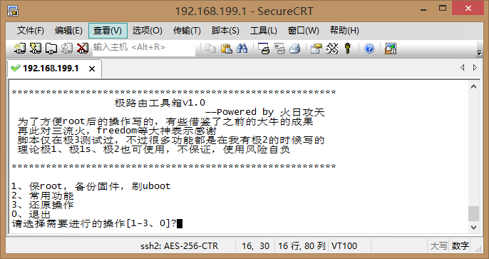

# 极路由器root后一键工具箱

#工具箱注意事项：
* 理论上适用于极路由1s，极硬货，极路由2，极路由3，并运行hiwifi原版系统（刷了别的系统的请刷回极os）
* 本工具箱仅为技术学习交流使用，不得用于商用
* 我只在极路由1与3测试过脚本，理论通用，出现问题，本人和本文不承担任何直接和间接责任，责任由使用者自行承担。
* 仅限root后使用工具箱，官方已经开放官root，故不讨论如何利用漏洞root
* 感谢前人的努力，包括freedom、三流火、inter、hackpascal等大神，本工具箱的编写也吸取了前人许多宝贵的经验，再次对他们的努力表示感谢

#工具箱使用方法  
`cd /tmp; rm -f hiwifi.sh;curl -o hiwifi.sh -k -s https://raw.githubusercontent.com/firesunCN/HiWiFi_Smart_Toolbox/master/hiwifi.sh;sh hiwifi.sh;rm -f hiwifi.sh`
* 通过ssh连接路由器，复制上面的命令，粘贴回车即可

#选项详细解释

###1. 保root，备份固件，刷uboot

包含备份固件分区，备份编程器固件，备份加密分区密码，在升级后保持root，不更新uboot，刷breed的bootloader或者刷自己的uboot，关闭恢复出厂设置的功能。

1. 升级后保持root，不更新uboot
	
	修改系统文件达到升级后不丢root，并且不更新uboot，理论上一次操作即可，为保险起见，每次升级后都建议执行。请不要恢复出厂设置，或者在加电情况下长按reset键，这样会丢root，如果怕手残，请执行下面的4
2. 备份所有（mtd0-9，SD卡加密分区密码）

	备份所有分区，生成编程器固件，备份加密分区密码，备份后的所有文件都在/tmp目录下，用winscp拷出来就行了，或者可以去常用功能里开启根目录共享，直接在我的电脑里复制。
3. 刷uboot
	
	可以选刷极1s、极2的breed bootloader（可以看出加强版的不死uboot），具体请访问http://www.right.com.cn/forum/thread-161906-1-1.html，也可以选自己的uboot，自己指定路径即可
4. 关闭reset功能（防失去root）
		
	防止手残，去掉后台的恢复出厂设置，直接关闭加电情况下长按reset键的功能，长按也不会reset，用后请重启路由器
5. 还原reset功能
0. 返回

###2. 常用功能
	
包含很多实用的功能

1. 开启根目录共享（强烈建议开启）
2. 允许远程访问ssh
3. 使用openwrt源
4. 去除4006024680.com
5. Hosts操作
6. 移除华3认证
7. 移除锐捷认证
0. 返回

###3. 还原操作

还原实用功能里做的操作

1. 关闭根目录共享
2. 禁止远程访问ssh
3. 还原hiwifi源
4. 还原4006024680.com
